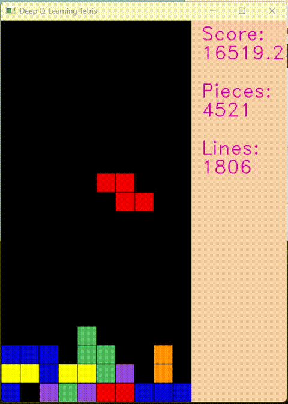

# 用 Dueling Double DQN 训练 AI 自主游玩俄罗斯方块

基于 PyTorch 实现的 **Dueling Double DQN** 强化学习算法，让 AI 学会自主游玩俄罗斯方块。

## Demo



## 项目结构

```
├── core/
│   ├── game.py              # 俄罗斯方块游戏环境
│   └── deep_q_network.py    # Dueling DQN 神经网络模型
├── training.py              # 训练入口脚本
├── play.py                  # 使用训练好的模型进行表演
├── requirements.txt         # Python 依赖
├── LICENSE                  # MIT 许可证
└── README.md
```

## 训练效果

训练至 Epoch 2045/5000 时，最佳成绩：

| 指标 | 数值 |
|------|------|
| 最高分 | 399,606 |
| 单局放置方块 | 98,958 个 |
| 单局消除行数 | 39,571 行 |
| Loss | 6.56 → 5.13（持续下降） |
| Epsilon | 0.001（已完全收敛，不再随机探索） |

## 算法详解

### 总体思路

AI 面对**每一个方块**，尝试所有可能的落点（旋转 × 位置），用神经网络评估每个落点的"好坏"，然后选最优的那个落下去。每局游戏结束后，AI 回顾自己的经验来修正神经网络的判断，逐渐学会越玩越好。

### 状态表示

AI "看"到的不是棋盘画面，而是 4 个数字（`game.py: get_state_properties`）：

| 特征 | 含义 | AI 该怎么理解 |
|------|------|------|
| `lines_cleared` | 这一落消了几行 | 越多越好 |
| `holes` | 棋盘上有多少空洞（被盖住的空格） | 越少越好 |
| `bumpiness` | 相邻列的高度差总和 | 越小越好（越平坦） |
| `height` | 所有列的高度总和 | 越低越好 |

例如一个状态：`[1, 3, 12, 45]` → 消了 1 行，有 3 个洞，凹凸度 12，总高度 45。

### 奖励函数（`game.py: step`）

奖励由两部分组成：**消行奖励** + **棋盘质量惩罚**，让 AI 每一步都收到直接反馈：

```
基础奖励:
  放置方块:              +1
  消除 N 行:             +N² × 棋盘宽度
    - 消 1 行:           +1 + 1 × 10 = +11
    - 消 2 行:           +1 + 4 × 10 = +41
    - 消 3 行:           +1 + 9 × 10 = +91
    - 消 4 行 (Tetris):  +1 + 16 × 10 = +161

棋盘质量惩罚（每步即时反馈）:
  空洞数 × 0.36:        空洞越多扣得越多
  凹凸度 × 0.18:        棋盘越不平坦扣得越多
  总高度 × 0.01:        堆得越高扣得越多

游戏结束:                -5
```

- 消行奖励使用 **平方** 设计，鼓励 AI 追求一次消多行
- 棋盘质量惩罚让 AI **每步** 都知道"你放得好不好"，而不只是等到消行才有反馈
- 游戏结束惩罚从 -2 增加到 -5，让 AI 更重视生存

### 网络架构：Dueling DQN

传统 DQN 直接输出一个 Q 值，无法区分"这个局面本身好不好"和"这个动作好不好"。Dueling DQN 将网络分为两个分支：

```
输入 [lines_cleared, holes, bumpiness, height]
  → fc1: Linear(4 → 128) → ReLU
  → fc2: Linear(128 → 256) → ReLU
  → fc3: Linear(256 → 256) → ReLU
  → 分支:
      Value Stream (V):      Linear(256→128) → ReLU → Linear(128→1)   "这个状态值多少"
      Advantage Stream (A):  Linear(256→128) → ReLU → Linear(128→1)   "这个动作比平均好多少"
  → 合并: Q = V + (A - mean(A))
```

- **Value Stream** 学会评估棋盘整体局面的好坏（和具体动作无关）
- **Advantage Stream** 学会评估在当前局面下，这个落点比平均水平好多少
- 合并时减去 `mean(A)` 保证两个分支可辨识

### 训练流程

#### 1. Epsilon-Greedy 探索 → 利用

```
epsilon 从 1.0 线性衰减到 0.001（衰减 2000 个 epoch）

训练初期 (epsilon ≈ 1):   几乎完全随机落子，到处尝试
训练中期:                   一半随机，一半按网络建议
训练后期 (epsilon ≈ 0):    几乎完全听从网络，只选最优解
```

#### 2. 经验回放（Experience Replay）

每次游戏结束，把 `(当时状态, 实际奖励, 下一状态, 是否结束)` 存入经验池（最多 30000 条）。训练时随机抽取 512 条经验来学习，打破相邻样本之间的相关性。

#### 3. Double DQN — 解决 Q 值高估问题

标准 DQN 用 Target Network 同时选动作和评估价值，容易高估 Q 值。Double DQN 改为：

```
标准 DQN:  目标 Q = reward + γ × max(Target Network 对所有动作的评分)
Double DQN: 目标 Q = reward + γ × Target Network 对 主网络选出的最优动作 的评分
                                    ↑                        ↑
                               评估价值                    选择动作
```

用主网络选动作，用 Target Network 评估，两者解耦后更准确。

#### 4. Target Network 定期同步

每 500 个 epoch，把主网络的权重复制到 Target Network。Target Network 只用来计算目标 Q 值，不参与梯度更新，保证训练稳定。

#### 5. Huber Loss（Smooth L1 Loss）

替代 MSE Loss。当 TD error（预测误差）较小时等价于 MSE；误差较大时自动切换为线性梯度，防止异常经验导致梯度爆炸。

#### 6. Gradient Clipping

每次更新前，将梯度范数裁剪到最大 10，防止偶尔出现的极端梯度破坏网络权重。

#### 7. 学习率衰减

使用 `StepLR` 策略，每 1000 个 epoch 学习率减半。训练后期更精细地调整参数。

### 自我进步的完整流程

```
随机探索 → 积累经验 → 从经验中学习 → 网络越来越准 → 逐渐信任网络 → AI 越玩越好
```

AI 之所以能进步，本质是：**每一次游戏结束后的经验都被记录下来，网络通过不断回看这些历史经验，逐渐学会了"什么样的棋盘状态是好的"。**

## 训练输出说明

训练时每局游戏结束会输出一行日志：

```
Epoch: 2045/5000, Loss: 6.5601, LR: 0.000125, Epsilon: 0.0010, Action: (3, 1), Score: 399606.81, Tetrominoes: 98958, Cleared lines: 39571, Best: 247015.01
```

| 字段 | 含义 |
|------|------|
| `Epoch` | 当前训练轮次 / 总轮次 |
| `Loss` | 当前批次训练损失，越小模型越准确 |
| `LR` | 当前学习率（随训练逐步衰减） |
| `Epsilon` | 当前探索率，越高越随机，越低越依赖网络 |
| `Action` | 本局最后一步的动作，格式为 `(x位置, 旋转次数)` |
| `Score` | 本局游戏得分 |
| `Tetrominoes` | 本局放置的方块总数 |
| `Cleared lines` | 本局消除的行数 |
| `Best` | 历史最高分（达到 `target_score` 时自动停止） |

## 环境依赖

- Python 3.8+
- PyTorch
- NumPy
- OpenCV (`opencv-python`)
- Pillow
- Matplotlib
- TensorBoardX

安装依赖：

```bash
pip install -r requirements.txt
```

## 使用方法

### 开始训练

```bash
python training.py
```

### 训练并实时查看游戏画面

```bash
python training.py --render
```

### 达到目标分数自动停止训练

```bash
python training.py --target_score 100000
```

训练过程中当单局得分达到目标值时，自动停止训练并保存最佳模型。默认为 0（不限制，训练完所有 epoch）。

### 查看训练好的模型表演

```bash
# 看最佳模型表演一局
python play.py

# 指定模型文件，连续看 5 局
python play.py --model trained_models/tetris --games 5

# 全部参数
python play.py --model trained_models/tetris_best --games 3 --fps 30
```

| 参数 | 默认值 | 说明 |
|------|--------|------|
| `--model` | trained_models/tetris_best | 模型文件路径 |
| `--fps` | 30 | 回放帧率 |
| `--games` | 1 | 连续玩几局 |

### 自定义训练参数

```bash
python training.py --num_epochs 5000 --batch_size 256 --lr 5e-4 --render
```

### 全部训练参数说明

#### 游戏环境参数

| 参数 | 默认值 | 说明 |
|------|--------|------|
| `--width` | 10 | 棋盘宽度（列数），标准俄罗斯方块为 10 列 |
| `--height` | 20 | 棋盘高度（行数），标准俄罗斯方块为 20 行 |
| `--block_size` | 30 | 渲染时每个方块的像素大小，越大窗口越大 |

#### 训练核心参数

| 参数 | 默认值 | 说明 |
|------|--------|------|
| `--num_epochs` | 3000 | 总训练轮次（epoch），每局游戏结束计为 1 个 epoch。训练越久模型越好，但收益会递减 |
| `--batch_size` | 512 | 每次训练从经验池中采样的样本数量。较大的值训练更稳定，但内存占用更高 |
| `--lr` | 1e-3 | 初始学习率，控制每次参数更新的步长。太大训练不稳定，太小收敛慢 |
| `--gamma` | 0.99 | 折扣因子，决定未来奖励的重要程度。0.99 表示 AI 会考虑较长远的结果；降低则更注重眼前利益 |
| `--target_score` | 0 | 目标分数，当历史最高分达到此值时提前结束训练并保存模型。设为 0 表示不限制，训练完所有 epoch |

#### 探索策略参数

| 参数 | 默认值 | 说明 |
|------|--------|------|
| `--initial_epsilon` | 1 | 初始探索率，1.0 表示训练开始时完全随机落子 |
| `--final_epsilon` | 1e-3 | 最终探索率，0.001 表示训练后期几乎完全依赖网络决策 |
| `--num_decay_epochs` | 2000 | 探索率从初始值线性衰减到最终值所经历的 epoch 数。增大此值会让 AI 探索更久，可能发现更优策略 |

#### 经验回放参数

| 参数 | 默认值 | 说明 |
|------|--------|------|
| `--replay_memory_size` | 30000 | 经验回放池的最大容量，存储历史游戏经验。池越大能回看更多历史，训练越稳定，但内存占用更高 |
| `--target_update` | 500 | 每隔多少 epoch 将主网络权重同步到 Target Network。太频繁会降低 Double DQN 的效果，太稀疏则训练不稳定 |

#### 优化与稳定性参数

| 参数 | 默认值 | 说明 |
|------|--------|------|
| `--lr_decay_step` | 1000 | 每隔多少 epoch 进行一次学习率衰减 |
| `--lr_decay_gamma` | 0.5 | 学习率衰减倍数，每到达 `lr_decay_step` 时学习率乘以此值（如 0.5 即减半） |
| `--grad_clip` | 10 | 梯度裁剪阈值，防止极端梯度破坏网络权重。梯度的 L2 范数超过此值时会被裁剪 |

#### 其他参数

| 参数 | 默认值 | 说明 |
|------|--------|------|
| `--render` | False | 是否在训练时显示游戏画面。开启可观察训练过程，但会显著拖慢训练速度 |
| `--log_path` | tensorboard | TensorBoard 日志保存目录，可用 `tensorboard --logdir=路径` 查看 Score/Loss/LR 等曲线 |
| `--saved_path` | trained_models | 模型文件保存目录，最佳模型保存为 `tetris_best`，最终模型保存为 `tetris` |

### 查看 TensorBoard 训练曲线

```bash
tensorboard --logdir=tensorboard
```

## 游戏特性

- 7 种标准俄罗斯方块（I、O、T、S、Z、J、L）
- 7-bag 随机系统（保证方块分布均匀）
- 实时 OpenCV 渲染，显示得分、方块数、消除行数
- 支持 GPU 加速训练（自动检测 CUDA）

## License

[MIT](LICENSE)
